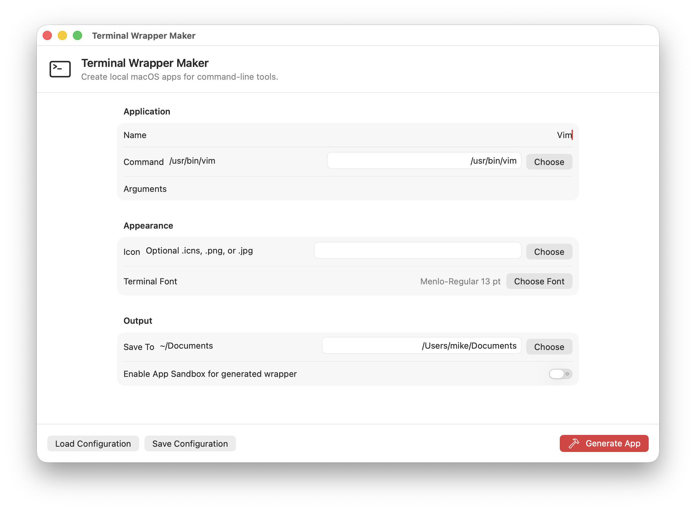
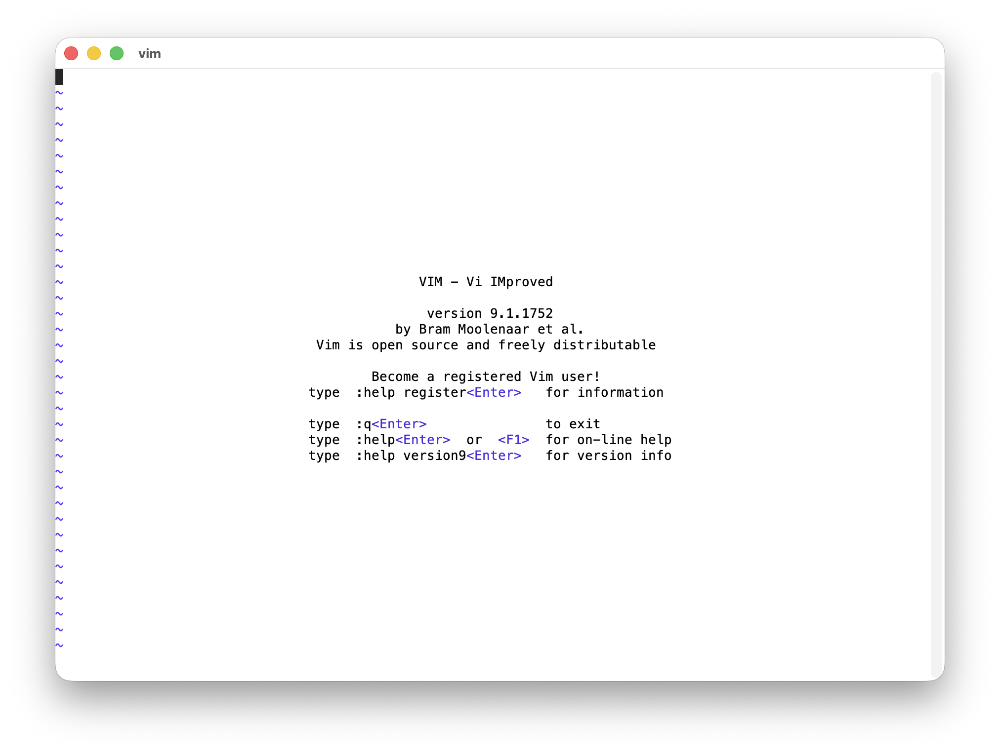

# TermWrap
A small macOS utility application to generate app bundles from command line tools/TUI apps. 





## Purpose
One small roadblock that's been blocking me from moving to more TUI based applications is the fact that they ALL have to run in a Terminal. Sometimes, there exist community made wrappers around these, but oftentimes I just want a basic wrapper that shows up as an independent application. 

This is exactly where TermWrap comes in: TermWrap wraps a TUI application as an application wrapper so that it shows up in Cmd+Tab and as a dedicated window. That's it. The rest is in the hands of the application you want to embed.

This is a similar approach to what applications like CrossOver, Whisky, Cask, or WineBottler do so you don't have 23059823409 `wine.app`s running around in your dock, or they're not all tied to a single `wine.app`. 

## How does it work?
This repository consists of two projects:

* `TermWrap` - A SwiftUI application for generating wrapped Terminal applications
* `TermWrapHost` - A configurable wrapper executable embedding SwiftTerm for Terminal emulation support. Launches a pre-configured executable within a Terminal emulator.

Beyond that, the rest is in the hands of the application you choose to embed. 

## How big is each wrapper?
Currently, due to the dependency of `SwiftTerm` and extra symbols brought in, each wrapper is around 2.2 MB. Most of that is within the main `TermWrapHost` executable.

### Potential size reduction ideas
The quickest reduction is to build `TermWrapHost` with size-focused release flags and strip local symbols before bundling it. In local testing, `-Osize`, `-gnone`, `-dead_strip`, and `strip -x` reduced `TermWrapHost` from around 2.2 MB to around 1.1 MB.

The larger architectural option is to stop copying the full host runtime into every wrapper. Generated wrappers could launch a shared `TermWrapHost` installed once in the main `TermWrap.app` bundle or in Application Support, leaving each wrapper with only its app metadata, icon, configuration, and a tiny launcher.

Another middle-ground option is to use APFS clone copies when generating wrappers on the same volume. Each wrapper still appears to contain its own host executable, but the filesystem can share the underlying storage until one copy changes.

Deeper reductions would require trimming or forking `SwiftTerm` itself, since most of the remaining binary size comes from the terminal emulator implementation rather than TermWrap's host code.

## Can you set custom icons?
Custom icons are supported, this path is located in `WrapperGenerator.swift` as `PrepareIconIfNeeded`. `icns` files are passed directly through to the app bundle while non-icns files are ran through `sips` and `iconutil` to generate a full `icns` bundle. Sizes 16x16 - 512x512 are generated @1x and @2x.

## Can you set custom arguments?
Yes! Custom arguments are supported!

## What happens when the hosted application is exited?
`TermWrapHost` automatically quits when the child application quits. 

# Building and running 
Dependencies: 
* Xcode command line tools
* Supported macOS version (macOS 14 or higher)

## Building
Open a Terminal in the current directory and run:
```sh
./build.sh
```

The build will be placed into the `Build/` directory. Old builds are dated and migrated to `Build/PreviousBuilds/`, the latest build is always `Build/TermWrap.app`. 

## Running
You can either manually open `Build/TermWrap.app` or in your Terminal, run:

```
./run.sh
```

The app bundle will open.
